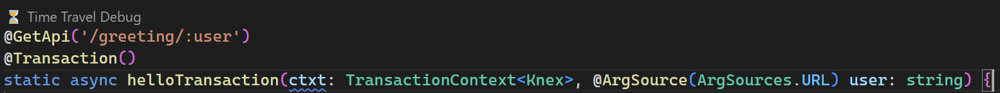
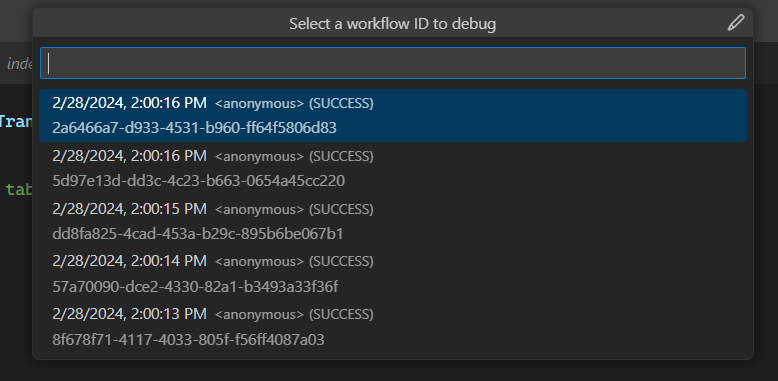

# DBOS Time Travel Debugger

This extension enables developers to debug their DBOS applications deployed to the DBOS Cloud using VS Code.
DBOS Cloud allows time travel debugging of any DBOS application execution that has occurred in the past three days.

## Time Travel Debug CodeLens 

The DBOS Time Travel Debugger extension attaches a "⏳ Time Travel Debug" 
[CodeLens](https://code.visualstudio.com/blogs/2017/02/12/code-lens-roundup)
to every DBOS [workflow](https://docs.dbos.dev/tutorials/workflow-tutorial),
[transaction](https://docs.dbos.dev/tutorials/transaction-tutorial)
and [communicator](https://docs.dbos.dev/tutorials/communicator-tutorial) method in your DBOS application.

When you click on the Time Travel Debug CodeLens, you are provided a list of recent executions of that method to debug.

After selecting a recent execution of your function, the DBOS Time Travel Debugger will launch the DBOS debug runtime 
and VS Code typescript debugger. This allows you to debug your DBOS application against the database as it existed 
at the time the selected execution originally occurred.

For more information, please see the [official DBOS documentation](https://docs.dbos.dev/).

## Installation

The latest released version of the DBOS Time Travel Debugger for VS Code can be installed via the 
[VS Code Marketplace](https://marketplace.visualstudio.com/publishers/dbos-inc). 

DBOS depends on [Node.js](https://nodejs.org/) version 20 or later. 
The DBOS Time Travel Debugger for VS Code has no additional dependencies beyond what DBOS depends on.

### Preview Releases

The DBOS Time Travel Debugger builds every commit in our [GitHub repo](https://github.com/dbos-inc/ttdbg-extension).
You can install a preview build of the Time Travel Debugger extension navigating to a recent 
[GitHub action run](https://github.com/dbos-inc/ttdbg-extension/actions/workflows/on_push.yml)
and downloading the associated "Extension" build artifact. 
The "Extension" build artifact is a zip file containing the Time Travel Debugger's VSIX file, which can be installed manually.
For more information on installing VSIX extensions in Visual Studio Code, please see the
[official Visual Studio Code docs](https://code.visualstudio.com/docs/editor/extension-gallery#_install-from-a-vsix).

## Versioning Strategy

The DBOS Time Travel Debugger extension uses the following
[VSCode recommendation](https://code.visualstudio.com/api/working-with-extensions/publishing-extension#prerelease-extensions)
for handling version numbers:

> We recommend that extensions use `major.EVEN_NUMBER.patch` for release versions and 
> `major.ODD_NUMBER.patch` for pre-release versions. 
> For example: `0.2.*` for release and `0.3.*` for pre-release.

The `main` branch of this repo tracks release quality work. 
As such, the `main` branch will always have an even minor version number.
Pre-release quality work (when happening) will be tracked in the `dev` branch.
The `dev` branch minor version number will always be odd and one greater than the current `main` branch minor version number.

Release versions of the extension are published out of release branches.
Pre-release versions are published directly out of the `dev` branch. 

Release branches are always created from the main branch.
Usually, `main` and `dev` branches both have their minor version incremented by two when a release branch is created

> Note, this project uses NerdBank Git Versioning to manage release version numbers.
> As such, patch versions of public releases will typically not be sequential. 
