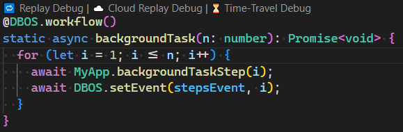

# DBOS Debugger

This extension enables developers to debug previous executions of their DBOS applications, both running locally and in DBOS Cloud.

## Local Replay Debugging

The DBOS Debugger extension attaches a "🔁 Replay Debug" 
[CodeLens](https://code.visualstudio.com/blogs/2017/02/12/code-lens-roundup)
to every DBOS [workflow](https://docs.dbos.dev/tutorials/workflow-tutorial) method in your DBOS application.

When you click the Replay Debug CodeLens, you are provided a list of recent executions of that workflow to debug.
This list of recent executions is retrieved from your DBOS application's database (specified in the `dbos-config.yaml` file)

After selecting a recent execution of your workflow, the DBOSDebugger will launch the DBOS runtime in debug mode and attach the VS Code Node debugger. 
This will allow you to debug the logic of the workflow function associated with that execution.
DBOS [Steps](https://docs.dbos.dev/typescript/tutorials/step-tutorial), [Transactions](https://docs.dbos.dev/typescript/tutorials/transaction-tutorial)
and [Stored Procedures](https://docs.dbos.dev/typescript/tutorials/stored-proc-tutorial) are skipped when Replay debugging.

## DBOS Cloud Replay Debugging

If you have deployed your DBOS Application to DBOS Cloud, the DBOS Debugger extension also attaches a "☁️ Cloud Replay Debug" CodeLens to your DBOS workflow methods.
Cloud replay debugging works similarly to local replay debugging, except the debugger connects the application to the DBOS Cloud database assoicated with your application instead of the application's local database.
This allows you to locally debug your workflow logic using the data from your production system. 

## DBOS Cloud Time Travel Debugging 

DBOS Cloud applications can optionally be deployed with time travel debugging enabled.
When enabled, DBOS Cloud automatically records every change made to your production database to a separate provenance database.

For applications that are time travel enabled, the DBOS Debugger extension attaches a "⏳ Time Travel Debug" to your DBOS Workflow methods.
When time travel debugging, you can step into DBOS Transaction and Stored Procedure functions as usual. 
Only DBOS step functions are skipped when time travel debugging. 
Queries in DBOS Transaction and Stored Procedure are executed against the provenance databas, so they reflect the state of the database as it existed at the time the selected workflow originally ran.

> Please see [official DBOS docs](https://docs.dbos.dev/cloud-tutorials/cloud-cli#dbos-cloud-app-deploy) for information on enabling Time Travel Debugging in DBOS Cloud.

## Interactive Time Travel Debugging

In addition code debugging, you can interactively explore the provenance database to see your application state as it existed in the past.

Once it is running, you can connect to the Time Travel Debugging Proxy using any existing Postgres compatible tool such as psql, pgAdmin or DBeaver.
For more information, please see the [DBOS Interactive Time Travel docs](https://docs.dbos.dev/cloud-tutorials/interactive-timetravel).

## Installation

The latest released version of the DBOS Debugger for VS Code can be installed via the 
[VS Code Marketplace](https://marketplace.visualstudio.com/publishers/dbos-inc). 

DBOS depends on [Node.js](https://nodejs.org/) version 20 or later. 
The DBOS Debugger for VS Code has no additional dependencies beyond what DBOS depends on.

### Preview Releases

The DBOS Debugger builds every commit in our [GitHub repo](https://github.com/dbos-inc/ttdbg-extension).
You can install a preview build of the DBOS Debugger extension by navigating to a recent 
[GitHub action run](https://github.com/dbos-inc/ttdbg-extension/actions/workflows/on_push.yml)
and downloading the associated "Extension" build artifact. 
The "Extension" build artifact is a zip file containing the DBOS Debugger's VSIX file, which can be installed manually.
For more information on installing VSIX extensions in Visual Studio Code, please see the
[official Visual Studio Code docs](https://code.visualstudio.com/docs/editor/extension-gallery#_install-from-a-vsix).

## Versioning Strategy

The DBOS Debugger extension uses the following
[VSCode recommendation](https://code.visualstudio.com/api/working-with-extensions/publishing-extension#prerelease-extensions)
for handling version numbers:

> We recommend that extensions use `major.EVEN_NUMBER.patch` for release versions and 
> `major.ODD_NUMBER.patch` for pre-release versions. 
> For example: `0.2.*` for release and `0.3.*` for pre-release.

The `main` branch of this repo tracks unreleased work.
Extension releases published to the VS Code marketplace from the `main` branch will always have an odd minor version number and will be marked as 
[pre-release](https://code.visualstudio.com/api/working-with-extensions/publishing-extension#prerelease-extensions).

Release versions of the extension are published out of release branches.
Extension releases published to the VS Code marketplace from release branches will always have an even minor version number.

> Note, this project uses NerdBank Git Versioning to manage release version numbers.
> As such, patch versions of public releases will typically not be sequential. 
